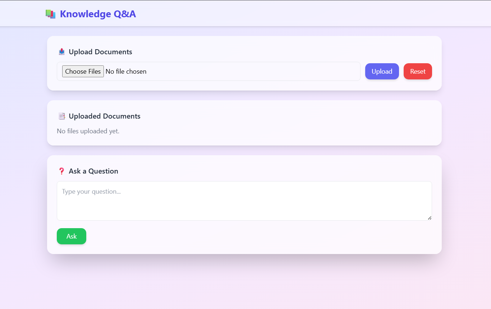
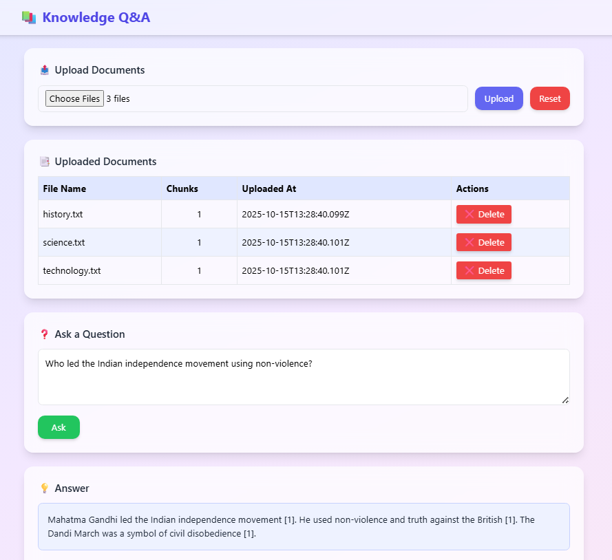
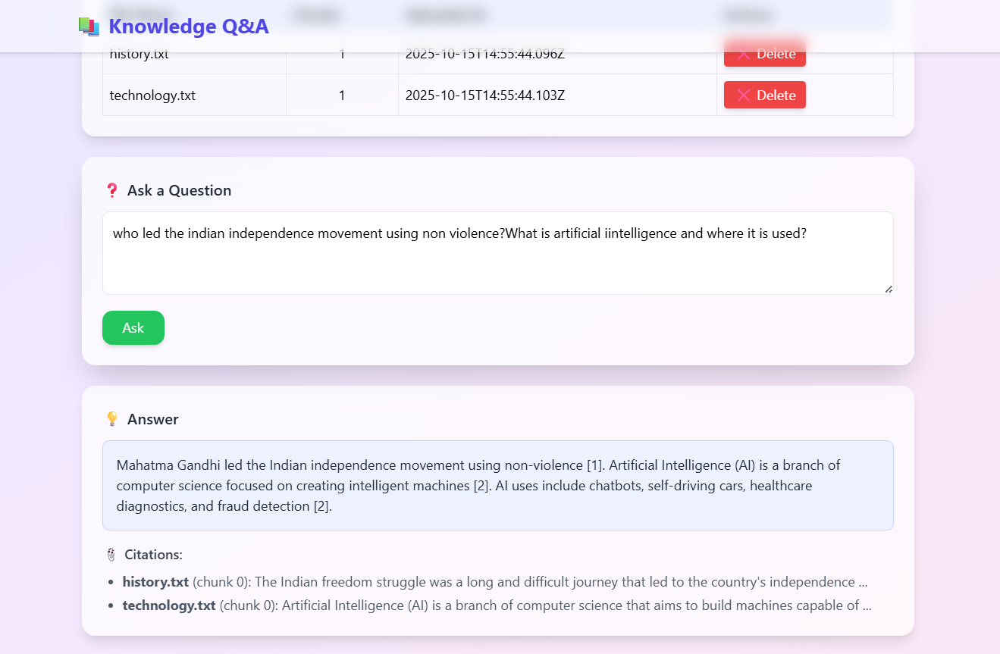

# Knowledge-Base Q&A (RAG powered)

An **AI-powered Knowledge Base Search Engine** that allows you to upload multiple documents, search across them, and get **synthesized answers** with citations using **Retrieval-Augmented Generation (RAG)**.  

Built with **React + Node.js + Google Gemini** 

---
🎥 ***[Watch Demo Video](https://drive.google.com/file/d/1qJLn75gpRRnGxSVOoDKPhJdlB0Cp8r4I/view?usp=sharing)***

---

---
 ***[Download zip file](https://drive.google.com/file/d/1B0cAcWkpIilLKfqE-bmM3YSJN55RxPyu/view?usp=sharing)***

---

## ✨ Features

✅ Upload multiple text documents (`.txt`, `.pdf`)  
✅ Dashboard view of uploaded documents (with delete option)  
✅ Ask natural language questions → get **concise AI-generated answers**  
✅ Built-in **semantic search** (cosine similarity over embeddings)  
✅ Answer citations 📎 for transparency  
✅ Reset knowledge base anytime  

---

## 🛠️ Tech Stack

- **Frontend**: React, TailwindCSS, Axios  
- **Backend**: Node.js, Express.js, Multer  
- **Storage**: Local JSON index  
- **LLM**: Google Gemini (Generative AI API)  
- **Embeddings**: Local simulated embeddings + cosine similarity  

---

## 📸 Screenshots (Demo)

**Upload & Dashboard View**  


**Query & Answer with Citations**  


 

---

## 💡 Why this project?
This project was built as part of my assignment for **Unthinkable Solutions**.  
My goal was to explore **RAG (Retrieval Augmented Generation)**, and show how  
traditional search + LLMs can be combined for powerful knowledge systems.

---

## ⚙️ Setup Instructions

### 1️⃣ Clone the Repository
```bash
git clone https://github.com/Nishu-06/Knowledge-Base-Search-Engine_Unthinkable
cd Knowledge-base
```
## 📂 Project Directory Structure
```
Knowledge-Base/
│
├── backend/            #Node.js + Express backend
│ ├── src/
│ │ ├── server.js       # Entry point of backend
│ │ ├── routes.js       # API routes
│ │ ├── store.js        # Index storage (JSON based)
│ │ ├── chunker.js      # Text chunking logic
│ │ ├── embedder.js     # Embedding + cosine similarity
│ │ └── synthesize.js   # Gemini integration (LLM answers)
│ │
│ └── data/             # Local index storage
│
├── frontend/           # React + Tailwind frontend
│ ├── src/
│ │ ├── App.js          # Main React component
│ │ └── components/     # UI components (Upload, Query, Dashboard)
│ │
│ └── public/           # Static assets (screenshots, etc.)
│
├── .env                # Environment variables (API keys, etc.)
├── README.md           # Project documentation
└── package.json        # Dependencies & scripts
```


